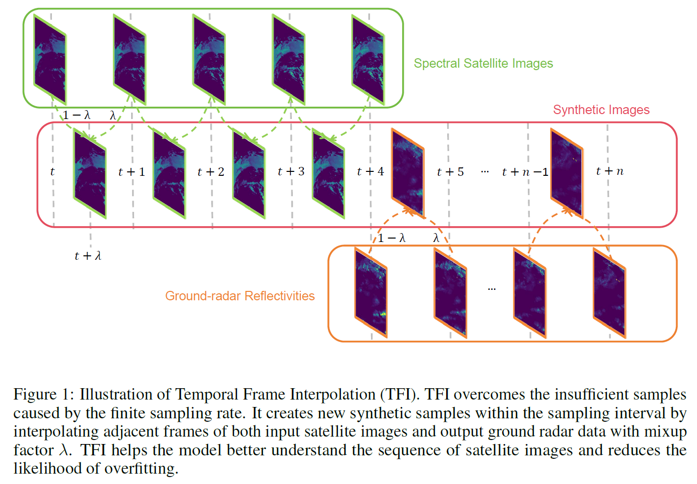

# UNetTFI
The **1st place** solution in [Weather4cast](https://weather4cast.net/) transfer learning leaderboard
## Overview

This repository contains the code and UNetTFI model used in [Weather4cast](https://weather4cast.net/) competition,
which achieves the **1st place** in the transfer learning leaderboard.
It includes trained models, their weights, configurations, and scripts to reproduce our results.

Our solution ([scientific paper](https://arxiv.org/abs/2311.18341)) utilizes the newly proposed Temporal Frame Interpolation (TFI) methods to enhance the model's understanding
of the image sequences, along with a new Multi-Level dice loss (ML-Dice) that improves the vanilla dice loss by
extracting ordinal relationship between rainfall rates.



## Introduction

The aim of the 2023 edition of the Weather4cast competition is to predict **quantitatively** future high resolution
rainfall events from lower resolution satellite radiances.

## Repository Structure

- `checkpoints/`: Contains the trained model weights.
- `models/`: Contains model architecture files.
    - `configurations/`: Contains YAML configuration files for model training and inference.
- `utils/`: Utility scripts including data loaders and evaluation scripts.
- `sub_4h.sh`, `sub_4h.trans.sh`, `sub_8h.sh`: Scripts to generate submissions using the models.
- `train.py`: The main training script for the models.
- `UNetTFI.yaml`: The conda envirnment.
- `COPYING`: The file containing the copyright information.
- `LICENSE`: The license file for the project.
- `README.md`: This file, explaining the project and setup.

## Environment Setup

To create an environment with the required dependencies, run:

```bash
conda env create -f w4cNew.yaml
```

Activate the environment with:

```bash
conda activate w4cNew
```

## Generate Submissions

To generate submissions, execute the following scripts in the repository's root directory, ensuring that the correct GPU
index, configuration file, and model checkpoint path are provided. Model weights can be found in releases.

For the UNetTFI 4-hour prediction on nowcasting dataset:

```bash
sh sub_4h.sh [gpu] models/configurations/UNetTFI_4h.yaml "checkpoints/UNetTFI_4h.ckpt"
```

For the UNetTFI 4-hour prediction on transfer dataset:

```bash
sh sub_4h.trans.sh [gpu] models/configurations/UNetTFI_4h_trans.yaml "checkpoints/UNetTFI_4h.ckpt"
```

For the UNetTFI 8-hour prediction on core challenge dataset:

```bash
sh sub_8h.sh [gpu] models/configurations/UNetTFI_8h.yaml "checkpoints/UNetTFI_8h.ckpt"
```

## Citation

```
@article{han2023learning,
  title={Learning Robust Precipitation Forecaster by Temporal Frame Interpolation},
  author={Lu Han, Xu-Yang Chen, Han-Jia Ye, De-Chuan Zhan},
  journal={arXiv preprint arXiv:2311.18341},
  year={2023}
}
```

